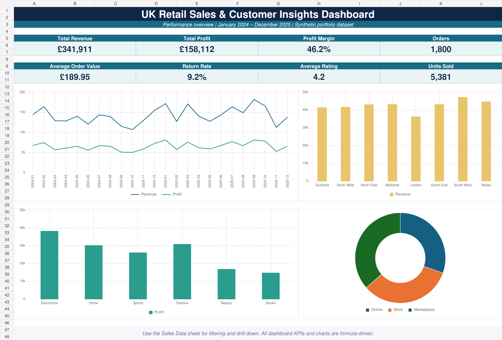

# UK Retail Sales & Customer Insights

A portfolio-ready data analytics project examining two years of UK retail transactions. It combines Excel, SQL and Python to identify revenue trends, profitability drivers, regional performance, channel mix, customer experience and return behaviour.

## Project objectives

- Track revenue, profit, orders, units, margin and average order value.
- Identify the strongest regions, categories and sales channels.
- Analyse monthly trends and return behaviour.
- Create clear, decision-focused recommendations for stakeholders.

## Dashboard preview



## Headline results

| KPI | Result |
| --- | ---: |
| Orders | 1,800 |
| Revenue | £341,910.52 |
| Profit | £158,111.52 |
| Profit margin | 46.2% |
| Average order value | £189.95 |
| Return rate | 9.2% |

The dashboard shows that Marketplace generated the most revenue, South West led regional revenue, and Electronics contributed the greatest category profit. These results are reproducible in Excel, SQL and Python.

## Dataset

The synthetic dataset contains 1,800 retail orders from January 2024 through December 2025. It includes:

- Order and customer identifiers
- Date and month
- UK region and sales channel
- Product category and product
- Quantity, price, unit cost and discount
- Revenue, cost and profit
- Customer rating and return status

Synthetic data is used so the project can be shared publicly without privacy or licensing restrictions.

## Technology stack

| Tool | Purpose |
| --- | --- |
| Microsoft Excel | KPI dashboard, formulas, charts and drill-down |
| SQL / SQLite | Reusable business-analysis queries |
| Python / pandas | Data validation, aggregation and visualisation |
| GitHub Actions | Automated Python validation |

## Repository structure

```text
uk-retail-sales-analytics/
├── data/
│   └── uk_retail_sales.csv
├── docs/
│   ├── dashboard-preview.png
│   ├── sales-data-preview.png
│   ├── monthly-analysis-preview.png
│   ├── segment-analysis-preview.png
│   └── business-insights-preview.png
├── outputs/
│   └── UK_Retail_Sales_Analytics_Dashboard.xlsx
├── python/
│   ├── analysis.py
│   └── load_sqlite.py
├── sql/
│   └── analysis_queries.sql
├── .github/workflows/
│   └── ci.yml
├── requirements.txt
└── README.md
```

## Run the Python analysis

```powershell
python -m venv .venv
.venv\Scripts\activate
pip install -r requirements.txt
python python/analysis.py
```

The script validates data quality, prints headline KPIs and creates analysis charts in `outputs/python_charts`.

## Run the SQL analysis

```powershell
python python/load_sqlite.py
sqlite3 outputs/uk_retail_sales.db
.read sql/analysis_queries.sql
```

## View and update retail orders

The source order data is stored in `data/uk_retail_sales.csv`. Each row represents one retail order.

### Open the order dataset

```powershell
code data\uk_retail_sales.csv
```

Edit the required order and save the file with `Ctrl + S`.

### Re-run the Python analysis

```powershell
python python\analysis.py
```

This validates the updated data, prints the latest KPIs and refreshes the charts in `outputs/python_charts`.

### Rebuild the SQLite database

```powershell
python python\load_sqlite.py
```

### Open the generated charts

```powershell
start outputs\python_charts
```

### Open the Excel dashboard

```powershell
start outputs\UK_Retail_Sales_Analytics_Dashboard.xlsx
```

Use the **Sales Data** worksheet to filter and inspect individual orders. Changes made to the CSV update the Python and SQL outputs; the Excel workbook contains its own copy of the data, so equivalent order changes must also be made in its **Sales Data** worksheet.

### Publish order updates to GitHub

```powershell
git status
git add .
git commit -m "Update retail order data"
git push
```

## Key analytical techniques

- Data-quality checks for nulls, duplicates and invalid values
- KPI calculations and profit-margin analysis
- Monthly time-series aggregation
- Regional, category and channel segmentation
- Return-rate and customer-rating analysis
- SQL CTEs, window functions and ranking
- Stakeholder-focused dashboard design

## Portfolio description

> Developed an end-to-end UK retail analytics project using Excel, SQL and Python. Analysed 1,800 transactions to evaluate revenue, profitability, regional performance, channel mix and returns. Built a formula-driven Excel dashboard, reusable SQL queries and pandas visualisations, translating findings into practical business recommendations.

## Data notice

All records are synthetic and created solely for learning and portfolio demonstration.
